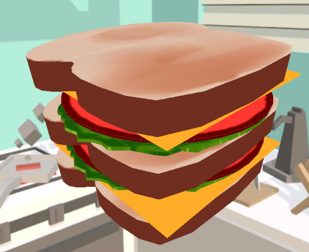

# 🥪 Welcome 2 Sandwich


How 2 Sandwhich is a hobby project that I made as a spinoff of my other small site called [How 2 Grilled Cheese](https://www.how2grilledcheese.com/) which just showed a quick svg animation of a grilled cheese sandwich being made as instruction for those who may not otherwise know how to make such a sandwich. 

This new site expands upon that feature set tremendously by making use of three.js to render 3D models of sandwhich ingredients and allow for any type of sandwich to be dynamically rendered for the user.

## 💭 Why Though?
While this suite of sites largely started out as an inside joke amongst friends I also have used it to expand upon some of my knowledge of the more basic underlying web technologies like configuring my own webpack build and trying to build more complex sites using nothing but basic javascript and css. The only exception library I have given myself here is the use of three.js as I also wanted to learn that. 

## ✋ Want to lend a hand?
Honestly the most time consuming part of this process has been learning how to 3D model everything from the beginning and I am still only very OK at it at the best of times. If anyone out there has some 3D modeling skills and would like to expand the sandwhich making capabilities of this site, feel free to make a PR to add in a .glb file of your model that is compatible with three.js.

## 💻 Deploying locally or development
I have no clue why anyone would want to contribute to this project, but if you want to deploy on your local machine, it is a webpack app that is making use of npm to handle its js packages, so pretty standard for the most part. I set up the npm scripts to build the bundle on ```npm run build``` and for a dev server to run on ```npm run dev```

Other than that, it is fairly straight forward vanilla html, css, and javascript. Any PR's appreciated!
